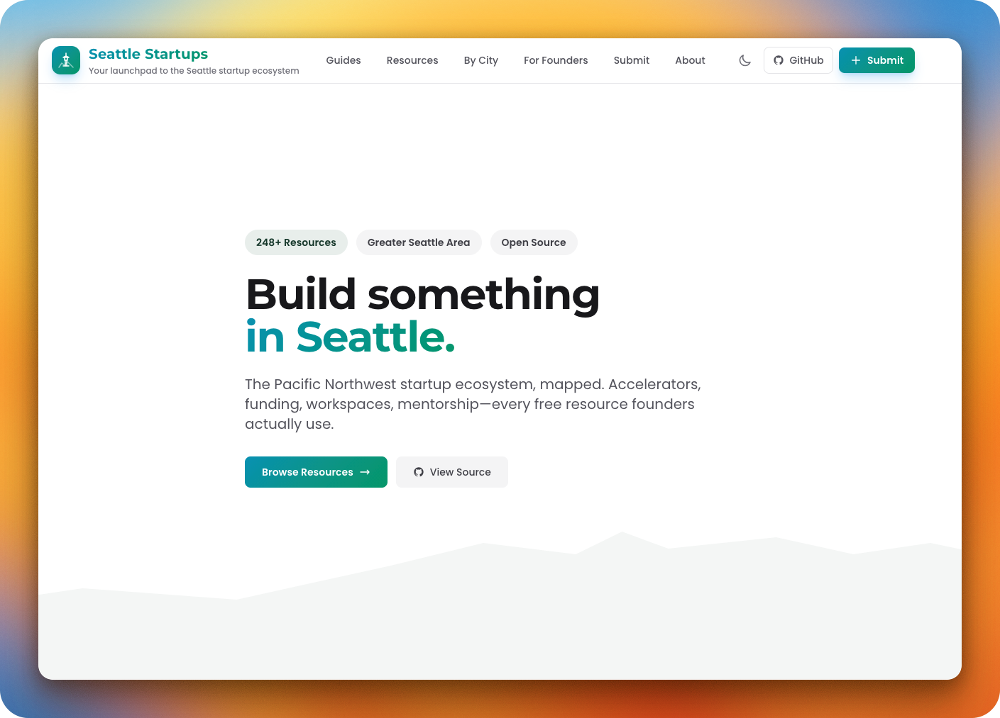

<p align="center">
  
  
  
  
</p>

<h1 align="center">🏔️ Seattle Startups</h1>

<p align="center">
  <strong>248+ free startup resources in Greater Seattle. Searchable. Filterable. No paywalls.</strong>
</p>

<p align="center">
  <a href="https://seattlestartups.info">🌐 Browse Resources</a> •
  <a href="#contribute">➕ Add a Resource</a> •
  <a href="https://github.com/adambkovacs/seattlestartups.info/issues">🐛 Report Issue</a>
</p>

<p align="center">
  <a href="https://www.buymeacoffee.com/adambkovacs" target="_blank"></a>
</p>

---

<p align="center">
  
</p>

---

## What's Here

Every free resource founders in Greater Seattle actually use:

| Category | Examples |
|----------|----------|
| **Accelerators** | WTIA Founder Cohort, Techstars Seattle, SEA619, CoMotion Labs |
| **Funding** | Seattle Angel Conference ($150K prize), WA State grants, pitch competitions |
| **Workspaces** | AI House Seattle, TheLab@Everett (free), library business centers |
| **Mentorship** | SCORE (free), SBDC advisors, founder circles |
| **Events** | Startup Seattle, Pioneer Square pitch nights, demo days |

### Area Covered

Seattle, Tacoma, Bellevue, Everett, Olympia, Bremerton, Lynnwood, Redmond, plus online/statewide programs.

Five counties: King, Pierce, Snohomish, Kitsap, Thurston.

---

## Use It

**Website:** [seattlestartups.info](https://seattlestartups.info)

Filter by city, category, audience (BIPOC, women, veteran founders), or search.

---

## Run Locally

```bash
git clone https://github.com/adambkovacs/seattlestartups.info.git
cd seattlestartups.info
hugo server
# → http://localhost:1313
```

Requires [Hugo](https://gohugo.io/installation/) (extended version).

---

## Contribute

### Add a Resource (5 minutes)

1. Fork this repo
2. Add entry to `data/resources/{category}.yaml`
3. Submit PR

```yaml
# Example: data/resources/accelerators.yaml
- name: "Your Program Name"
  description: "One sentence. What founders get."
  organization: "Who runs it"
  website: "https://..."
  cost: "Free"
  city: "Seattle"
  counties:
    - "King"
  categories:
    - "Accelerators"
```

**Requirements:**
- Free or has free tier
- Serves Greater Seattle area
- Currently active

### PR Review Process

Every PR runs automated checks:

1. **YAML validation** - syntax and required fields
2. **URL format check** - valid links
3. **Duplicate detection** - no redundant entries
4. **Hugo build test** - site compiles

PRs that pass get reviewed within 48 hours.

### Report an Error

[Open an issue](https://github.com/adambkovacs/seattlestartups.info/issues/new) with the resource name and what's wrong.

---

## Tech Stack

| Component | What |
|-----------|------|
| Static site | [Hugo](https://gohugo.io) |
| Styling | [Tailwind CSS](https://tailwindcss.com) |
| Hosting | GitHub Pages (free) |
| CI/CD | GitHub Actions |
| Domain | seattlestartups.info |

### How It Works

```
data/resources/*.yaml     → Resource data (structured)
content/cities/*.md       → City landing pages
content/guides/*.md       → SEO guide articles
themes/startup-theme/     → Custom Hugo theme
.github/workflows/        → Build + deploy automation
```

Push to `main` → GitHub Actions builds Hugo → deploys to GitHub Pages. Zero cost.

---

## Data Structure

Resources stored in `data/resources/`:

| File | Count |
|------|-------|
| `accelerators.yaml` | 22 |
| `mentorship.yaml` | 35 |
| `funding.yaml` | 28 |
| `spaces.yaml` | 31 |
| `events.yaml` | 24 |
| `government.yaml` | 42 |
| `libraries.yaml` | 23 |
| `universities.yaml` | 43 |

Each resource has: name, description, website, cost, city, counties, categories, and optional audience tags (bipoc, women, veterans, lgbtq).

---

## Support This Project

If you find this directory useful, consider buying me a coffee:

<a href="https://www.buymeacoffee.com/adambkovacs" target="_blank"></a>

---

## License

MIT. Use however you want.

Resource data is community-contributed. No warranties on accuracy.

---

<p align="center">
  <sub>Built for Seattle founders by <a href="https://www.linkedin.com/in/adambkovacs/">Adam Kovacs</a>. Zero paywalls. Zero gatekeeping.</sub>
</p>
